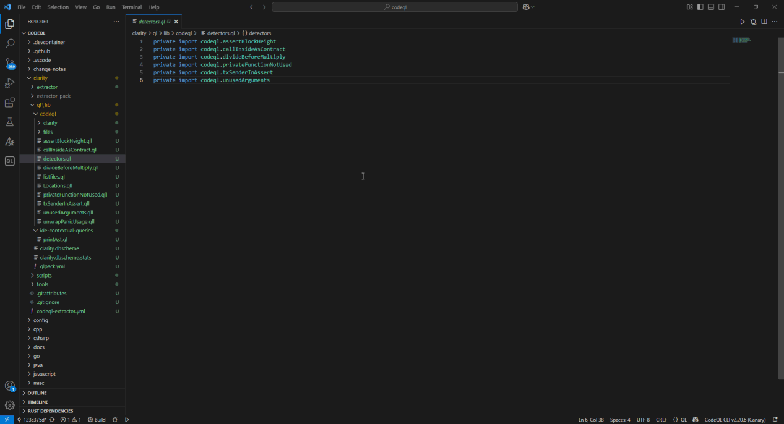

# ClarityQL

## Detect vulnerabilities in your Clarity smart contracts using CodeQL



This repository contains our team's ongoing research and development to extend CodeQL support to the Clarity smart contract language. We have adapted and expanded CodeQL to create a powerful toolset for performing static analysis on Clarity code.

## 🔍 Overview

Our goal is to provide a comprehensive set of tools for querying and detecting vulnerabilities in Clarity smart contracts. We build upon this [Clarity Tree-sitter grammar](https://github.com/xlittlerag/tree-sitter-clarity.git) and take a page from the CodeQL team's [Ruby implementation](https://github.blog/security/web-application-security/code-scanning-and-ruby-turning-source-code-into-a-queryable-database/). The project includes an extractor, database schema generation, and abstractions such as a cleaner Abstract Syntax Tree (AST), Control Flow Graph (CFG), and Dataflow analysis. These elements enable complex vulnerability detection and querying.

## 🚀 Project Status

- **Extractor and Database Schema**: ✅
- **A clean and intuitive AST**: ✅
- **Work in progress**: We are actively developing Controlflow and Dataflow support to enhance the detection of vulnerabilities.

## 🏁 Getting Started

To get started with analyzing Clarity smart contracts using CodeQL, follow these steps:

> [!NOTE]
> The installation guide will be simplified into an installation script, to set up all needed components smoothly.

- Follow the [CodeQL installation guide](https://docs.github.com/en/code-security/codeql-cli/getting-started-with-the-codeql-cli/setting-up-the-codeql-cli) to setup the `codeql` command.

- Clone the CodeQL libraries and utilities provided [here](https://github.com/github/codeql).

- Move the `clarity` folder inside the folder downloaded in the previous step.

- Inside the `clarity` folder, run the following script:
    ```bash
    ./scripts/create-extractor-pack.sh
    ```
    This will build the database extractor and Clarity database scheme.

> [!NOTE]
> It is recommended that you download the VSCode CodeQL official extension, as it makes managing your databases and queries a lot easier.

You are ready to create a database and start analyzing!

## Create a Database for your project

Creating a database is the first step in analyzing your project, as CodeQL works by parsing your Clarity contracts into a database and then running detectors made in a query language.\
You may create a database running the following command

```bash
codeql database create --overwrite --search-path codeql/clarity/extractor-pack -l clarity /destination-dir-for-db/ -s /directory-of-project-to-scan/
```

## Run Sample Detectors

Once the database is created, you can run any detectors written in the QL language:

```bash
codeql query run /path-to-detector/ -d /path-to-created-database/
```

## Detectors

Our current list of sample detectors is located in `ClarityQL\clarity\ql\lib\codeql\[detectorName].qll`.

| Num | Detector    | What it Detects                                                      |
| --- | ----------- | -------------------------------------------------------------------- |
| 1   | `assertBlockHeight` | Wrongful usage of block height                  |
| 2   | `callInsideAsContract` | Outside call inside an `as-contract` opcode |
| 3   | `privateFunctionsNotUsed` | Deadcode: unused functions declared as private    |
| 4   | `txSenderInAssert` |   Wrongful usage of `tx-sender`          |
| 5   | `divideBeforeMultiply` | Detects loss of precision  |
| 6   | `unusedArguments` | Arguments declared in a function but never used   |
| 7   | `unwrapPanicUsage` | Wrongful usage of a panic function    |


## 🤝 Contributing

We welcome contributions to enhance and expand the support for Clarity in CodeQL. Feel free to submit issues, feature requests, or pull requests.

For more information, please refer to the [Contribution Guidelines](/docs/Contributing.md).

## License

The code in this repository is licensed under the [MIT License](LICENSE.md).

For further information on CodeQL and CodeQL CLI licensing, please refer to the official [repo](https://github.com/github/codeql-cli-binaries).